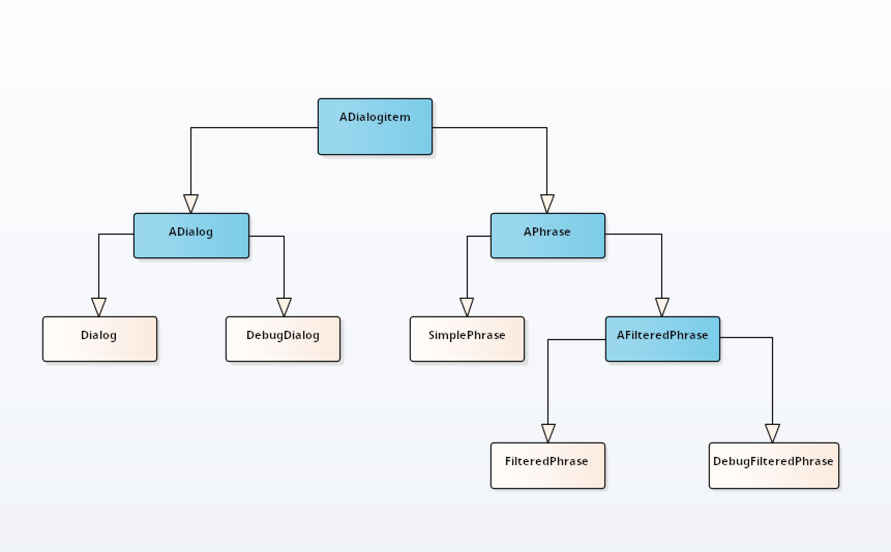
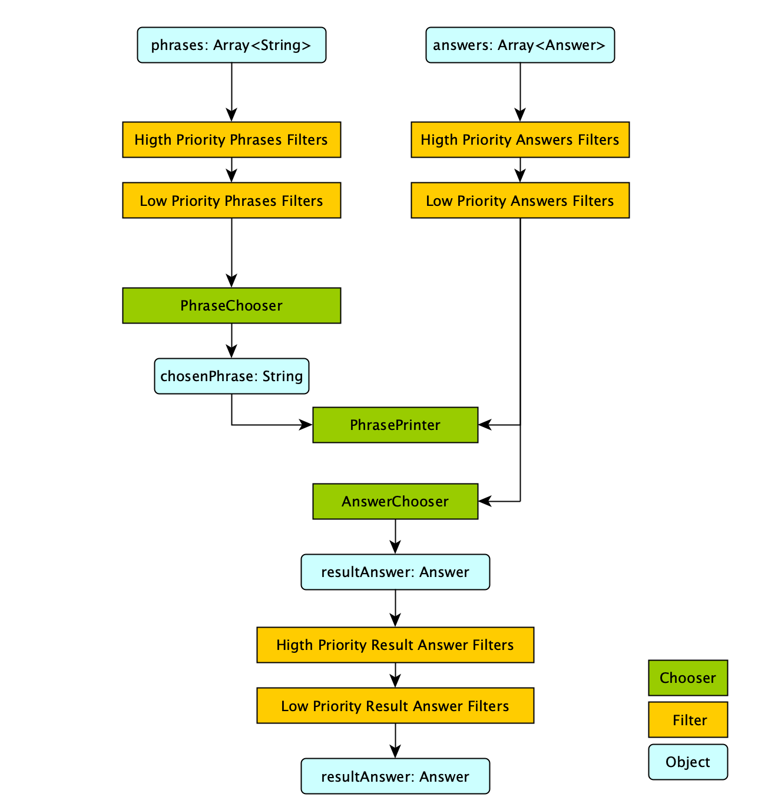
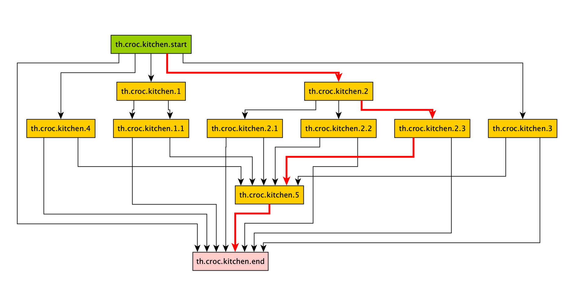

# Dialog System

This Library is used to create, simulate, and dynamic change progress of a dialog. 

## Quick start

```kotlin
   val dialog = Dialog("dialog");
    // create phrases 
   val phrase1 = SimplePhrase("phrase.1", "phrase 1: 2+2*2=?",
       arrayOf(
           Answer("phrase.2", "answer is 8"),
           Answer("phrase.3", "answer is 6")
       ))
   val phrase2 = SimplePhrase("phrase.2", "false", arrayOf(
        Answer( "exit", "exit",  AnswerType.EXIT)
   ))
   val phrase3 = SimplePhrase("phrase.3", "correct", arrayOf(
       Answer( "exit", "exit",  AnswerType.EXIT)
   ))
    // add phrases in a dialog
    dialog.addAll(listOf(phrase1, phrase2, phrase3))
    dialog.startDialogItem = phrase1 // set start point 
    dialog.run()                    // start this dialog 
```

# Main classes Description 

## ADialogItem




ADialogItem is a basic abstract object class. 

it contains an array of all possible answers and 3 public methods: 

* run() : Answer - process item, returns result Answer. 
* before() - public lambda listener, called before `run`, 
* after(result: Answer) - public lambda listener, called after `run`


```kotlin
 val item : ADialogItem = SimplePhrase(...) 
 item.before = { Door.lockBy(item) }
 item.after =  { Door.unlockBy(item, it) }
 val answer = item.run();
``` 

## Answer 
Answer describes an answer or reaction from a text phrase and say a `Dialog` what item has been run next. 

There are 3 types of Answers: 
* `Simple` - lead to next phrase inside one Dialog
* `Exit` - indicates the end of the dialog
* `Enter` - lead to nex dialog inside this dialog 

## Phrases

`APhrase` is a container for short `phrase text` of a speech and reaction of this phrase (`Answer`). 

There are 3 basic Phrases:

* `SimplePhrase` - default phrase
* `FilteredPhrase` - phrase without filters
* `DebugFilteredPhrase` - has additional listeners

> To cast one type to other use `APhrase.convertTo<T : APhrase> (phrase: APhrase): T`

All Phrases used :
* `PhraseChooser` - chooses only one phrase to print 
* `AnswerChooser` - chooses one answer (default using the console)
* `PhrasePrinter` - print chooses phrase by a PhraseChooser and all answers

### Simple Phrase
This is default Phrase without additional listeners 

```kotlin
 val phrase = SimplePhrase("phrase", "hello world",  arrayOf(Answer("exit", "exit")))
 phrase.run();
```

### FilteredPhrase

Filtered Phrase uses filters and dynamic changing of `text phrases` and `answers`.
There are 3 filters type: 
* `Phrases` filter
* `Answers` filter
* Result `Answer` filter

And 2 type of Priority: `high`, `low`
 

 
####  Filters Example 
 
```kotlin
    //create phrase
val phrase = FilteredPhrase(
        "filtered.phrase", // id
         "this phrase is run %CNT% time", //phrase text
        arrayOf(Answer("filtered.phrase", "try one more time"),  // loop
                Answer("exit", "exit", AnswerType.EXIT) )   // this answer will be visible only after second time
    )

//add filter for answer
phrase.addAnswersFilter("answer.filter") { answers, cnt ->
    return@addAnswersFilter if(cnt == 1)  {
            arrayOf(answers[0])
        }  else {
            answers
        }
}

//add filter for phrases
phrase.addPhrasesFilter("phrase.filter") { phrases, cnt ->
    return@addPhrasesFilter arrayOf(phrases[0].replace("%CNT%", cnt.toString()))
}

// run phrase as dialog
DialogBuilder("dialog")
    .addItem(phrase)
    .setStartItem(phrase) 
    .build()
    .run()
    
```

Filters are running in order of addition to phrase but according its priority level: 

```kotlin
 val filtered = FilteredPhrase(
                "filtered.phrase",
                "init phrase",
                arrayOf(Answer("exit", "exit", AnswerType.EXIT) )
            )


filtered.addPhrasesFilter("3", AFilteredPhrase.Order.Last){
        phrases, _ ->
    phrases[0]+="three\n"
    return@addPhrasesFilter phrases
}

filtered.addPhrasesFilter("4", AFilteredPhrase.Order.Last){
        phrases, _ ->
    phrases[0]+="four\n"
    return@addPhrasesFilter phrases
}

//default priority - hight
filtered.addPhrasesFilter("1"){
    phrases, _ ->
    phrases[0]+="\none\n"
    return@addPhrasesFilter phrases
}

filtered.addPhrasesFilter("2", AFilteredPhrase.Order.First){
        phrases, _ ->
    phrases[0]+="two\n"
    return@addPhrasesFilter phrases
}

filtered.run()

/*
phrase text: 
    "init phrase
    one
    two
    three
    four"
*/
```

### DebugFilteredPhrase

Has additional listeners for debugging

* `phrase.beforeFilter(..)`  - called before Beginn of first filter 
* `phrase.afterFilter(..)`  - called after End of last filter

## Dialog

>  Example of dialog  

 


A Dialog is a runner for many `DialogItems`. To storage and processing sequences of Dialogitems is using `Router`.  
This class contains a directed `graph` for describing connections from items. Dialog stops when  
an answers return `AnswerType.Exit` or `AnswerType.Enter`.

Its needed set `startDialogItem` for running a `Dialog`  - first item of dialog  
If one dialog can be started many times and the parameter `isResetToStart` manages 
the start point by next time: 
* `false` - dialog continued from last item in dialog
* `true` - dialog always starts from start(first) item


Dialog includes a `Router`, which include graph of items of this dialog.  


```kotlin
    val dialog = Dialog("dialog");
    dialog.addItem(phrase1)
    dialog.addItem(phrase2)
    dialog.addItem(phrase3)

    dialog.startDialogItem = phrase1 // start point 
    dialog.run(); // start this dialog     
```


### DebugDialog

Has additional listeners for debugging

  * `transformCurrentItem` - map current ADialogItem 
  * `transformIfCurrentItemIsPhrase`  -  map current Item if it is an APhrase
  * `transformIfCurrentItemIsDialog`  -  map current Item if it is an ADialog
  * `transformResultAnswer`  -  map answer from a current phrase in this dialog
  * `changeResult` - map result answer of hole dialog
  * `onExit` - event, when current item return EXIT/ENTER Answer type

## Router

Router describes sequence of `DialogItems` in a ADialog. It includes list of `Dialog`
items and graph of transitions between these items.    

Router includes list of items and graph of items connections. 
By saving of a router in a file, it 
* save graph as *.graphml file 
* save configuration of router in *json file


Its possible with `RouterTester` make some simple test of diaalog: 

```kotlin
 RouterTester.test(router)
                .checkStartPoint() // if start point != null 
                .checkTypesOfPhases() // last phrases return EXIT answer type
                .isGraphRelated() // all  phrases is conected
                .isItemsLinkedCorrectly() // all answers (exept last in dialog) connected 
                                          // and have answers type == SIMPLE 
                .isAllItemsHasVertex() // all items from list have vertext in graph 
                .isAllVertexHasItems() // all items from graph have item in list 
                .isFullFunctional() // list of vertex == list of items
``` 

# Input / Output to file

```kotlin
   val phrase : APhrase = ...
   val dialog : ADialog = ...
   
   //phrase 
    PhraseStream.write(phrase, file)
    val readPhrases: List<APhrase> = PhraseStream.read(file)
    
    //dialog
    DialogStream.write(dialog, pahtTorootDir)
    val dialogs: List<ADialog> = DialogStream.read(pahtTorootDir)

    // router
    val router = dialog.router
   RouterStream.write(router, pathToConfigFile, pathToGraphFolder)
   val routers: List<Routers> =  RouterStream.read(pathToFile, pathToGraphFolder)
    
```


